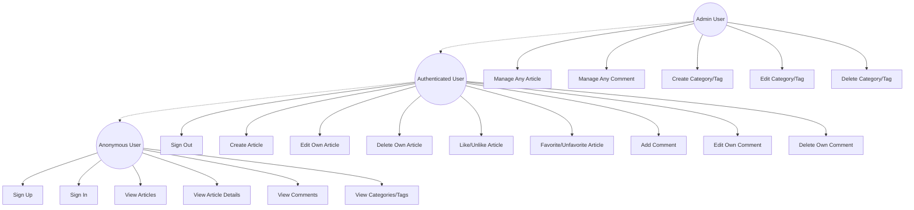
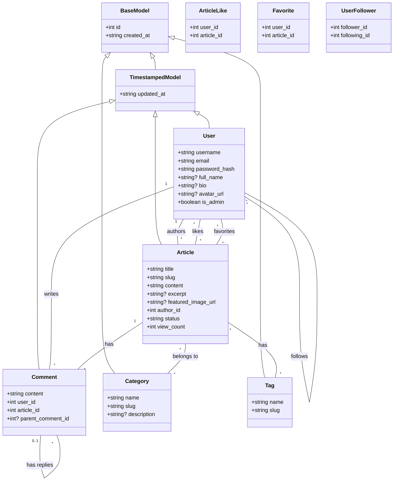

# Blog API Documentation

## 1. Project Overview

### General Description
Backend for a blog platform providing article management, comments, categories, tags, and user management features.

### Technologies
- Node.js with TypeScript
- Express.js for REST API
- Supabase for database and authentication
- PostgreSQL as database system

### Main Dependencies
```json
{
  "@supabase/supabase-js": "^2.47.12",
  "bcrypt": "^5.1.1",
  "cors": "^2.8.5",
  "dotenv": "^16.4.7",
  "express": "^4.21.2",
  "jsonwebtoken": "^9.0.2",
  "slugify": "^1.6.6"
}
```

## 2. Installation & Configuration

### Required Environment Variables
```
SUPABASE_URL=
SUPABASE_ANON_KEY=
SUPABASE_SERVICE_ROLE_KEY= (optional)
PORT= (default: 3000)
```

### Available Commands
```bash
npm run start     # Start server
npm run dev       # Start server in development mode
npm run build     # Compile TypeScript
```

## 3. System Architecture

### Folder Structure
```
src/
├── config/         # Configuration (database)
├── controllers/    # Business logic
├── middleware/     # Express middleware
├── models/         # Types and interfaces
└── routes/         # API routes
```

### Main Components
- Authentication & Authorization
- Article Management
- Comment System
- Taxonomy (Categories and Tags)
- User Management
- Likes and Favorites System

### Use Case Diagram



This diagram illustrates the different user roles and their available actions in the system:

- **Anonymous Users** can view public content and authenticate
- **Authenticated Users** can create and manage their own content, plus interact with other content (likes, comments)
- **Admin Users** have full management capabilities over all content and taxonomies

## 4. API Reference

### Base URL
`/api`

### Authentication
Bearer token required for protected routes:
```http
Authorization: Bearer <token>
```

### Endpoints

#### Authentication
- POST `/api/auth/signup`: Registration
    - Request body: `{ email, password, username, full_name }`
    - Response: `{ message, user }`

- POST `/api/auth/signin`: Login
    - Request body: `{ email, password }`
    - Response: `{ token, user }`

- POST `/api/auth/signout`: Logout
    - Headers: Bearer token
    - Response: `{ message }`

#### Articles
- GET `/api/articles`: List articles
    - Response: List of articles with author info and metadata

- GET `/api/articles/:slug`: Get article details
    - Response: Article with full details including comments

- POST `/api/articles`: Create article (auth required)
    - Request body: `{ title, content, excerpt?, featured_image_url?, categoryIds?, tagIds? }`
    - Response: Created article

- PUT `/api/articles/:id`: Update article (auth required)
    - Request body: `{ title?, content?, excerpt?, featured_image_url?, status?, categoryIds?, tagIds? }`
    - Response: Updated article

- DELETE `/api/articles/:id`: Delete article (auth required)
    - Response: 204 No Content

- POST `/api/articles/:id/like`: Like article (auth required)
    - Response: `{ likes_count }`

- DELETE `/api/articles/:id/like`: Unlike article (auth required)
    - Response: `{ likes_count }`

- POST `/api/articles/:id/favorite`: Favorite article (auth required)
    - Response: `{ favorites_count }`

- DELETE `/api/articles/:id/favorite`: Unfavorite article (auth required)
    - Response: `{ favorites_count }`

## 5. Data Models

### Class Diagram



The class diagram above illustrates the system's data model structure and relationships:

- All models inherit from either `BaseModel` or `TimestampedModel`
- Articles can have multiple categories, tags, and comments
- Comments can have parent-child relationships (nested comments)
- Users can interact with articles through likes, favorites, and comments
- Users can follow other users

### Database Tables
```sql
users (
  id, username, email, password_hash, full_name, bio, 
  avatar_url, is_admin, created_at, updated_at
)

articles (
  id, title, slug, content, excerpt, status, 
  featured_image_url, author_id, view_count, 
  created_at, updated_at
)

comments (
  id, content, user_id, article_id, parent_comment_id, 
  created_at, updated_at
)

categories (
  id, name, slug, description, created_at
)

tags (
  id, name, slug, created_at
)
```

### Relation Tables
```sql
article_categories (article_id, category_id)
article_tags (article_id, tag_id)
article_likes (user_id, article_id)
favorites (user_id, article_id)
user_followers (follower_id, following_id)
```

## 6. Security

### Authentication Mechanisms
- Supabase Auth integration
- JWT for session management
- Password hashing with bcrypt

### Authorization
Three access levels:
- Public: Reading public content
- Authenticated: Content creation, interactions
- Admin: Taxonomy and content management

## 7. Error Handling

Standard error response format:
```json
{
  "error": "Error description"
}
```

HTTP Status Codes:
- 400: Bad Request
- 401: Unauthorized
- 403: Forbidden
- 404: Not Found
- 500: Server Error